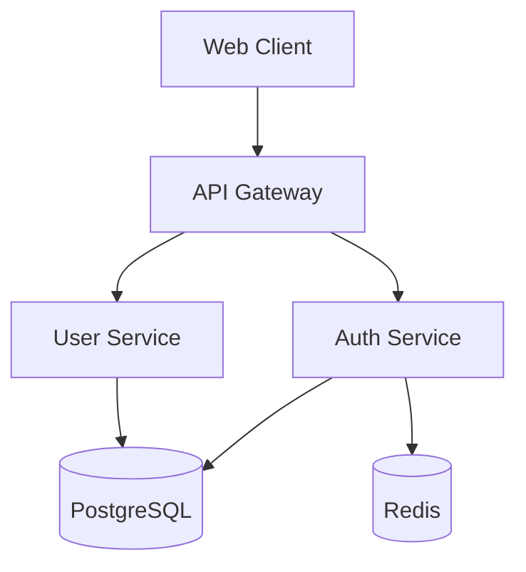
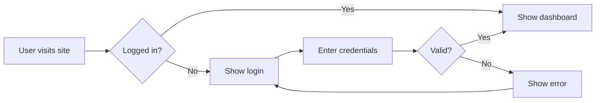

# VisualSDD Implementation Plan

> **For Claude:** REQUIRED SUB-SKILL: Use superpowers:executing-plans to implement this plan task-by-task.

**Goal:** Build a local-first visual spec-driven development tool where markdown files with Mermaid diagrams are the source of truth, rendered as interactive React Flow diagrams in a web UI.

**Architecture:** File-watcher model — a local Express server watches `specs/*.md` files and serves a React UI. The UI parses Mermaid code blocks into React Flow nodes/edges. Visual edits serialize back to Mermaid and save to the .md files. AI chat proxies through the user's existing CLI.

**Tech Stack:** React, @xyflow/react, dagre, mermaid, unified/remark, chokidar, CodeMirror, Tailwind CSS, Express, Vite, TypeScript

---

### Task 1: Project Scaffolding

**Files:**
- Create: `package.json`
- Create: `tsconfig.json`
- Create: `tsconfig.node.json`
- Create: `vite.config.ts`
- Create: `tailwind.config.js`
- Create: `postcss.config.js`
- Create: `index.html`
- Create: `src/main.tsx`
- Create: `src/App.tsx`
- Create: `src/index.css`

**Step 1: Initialize the project**

Run:
```bash
cd /Users/younan.nwesre/Desktop/personal/visualsdd
npm init -y
```

**Step 2: Install core dependencies**

Run:
```bash
npm install react react-dom @xyflow/react @dagrejs/dagre mermaid unified remark-parse remark-frontmatter remark-stringify rehype-stringify remark-rehype gray-matter @codemirror/state @codemirror/view @codemirror/lang-markdown @codemirror/theme-one-dark
```

**Step 3: Install dev dependencies**

Run:
```bash
npm install -D typescript @types/react @types/react-dom vite @vitejs/plugin-react tailwindcss @tailwindcss/vite postcss autoprefixer concurrently
```

**Step 4: Create Vite config**

Create `vite.config.ts`:
```typescript
import { defineConfig } from 'vite';
import react from '@vitejs/plugin-react';
import tailwindcss from '@tailwindcss/vite';

export default defineConfig({
  plugins: [react(), tailwindcss()],
  server: {
    proxy: {
      '/api': 'http://localhost:3001',
    },
  },
});
```

**Step 5: Create TypeScript config**

Create `tsconfig.json`:
```json
{
  "compilerOptions": {
    "target": "ES2020",
    "useDefineForClassFields": true,
    "lib": ["ES2020", "DOM", "DOM.Iterable"],
    "module": "ESNext",
    "skipLibCheck": true,
    "moduleResolution": "bundler",
    "allowImportingTsExtensions": true,
    "resolveJsonModule": true,
    "isolatedModules": true,
    "noEmit": true,
    "jsx": "react-jsx",
    "strict": true,
    "noUnusedLocals": true,
    "noUnusedParameters": true,
    "noFallthroughCasesInSwitch": true,
    "forceConsistentCasingInFileNames": true
  },
  "include": ["src"]
}
```

Create `tsconfig.node.json`:
```json
{
  "compilerOptions": {
    "target": "ES2020",
    "module": "ESNext",
    "moduleResolution": "bundler",
    "allowImportingTsExtensions": true,
    "resolveJsonModule": true,
    "isolatedModules": true,
    "noEmit": true,
    "strict": true
  },
  "include": ["vite.config.ts"]
}
```

**Step 6: Create index.html**

Create `index.html`:
```html
<!DOCTYPE html>
<html lang="en">
  <head>
    <meta charset="UTF-8" />
    <meta name="viewport" content="width=device-width, initial-scale=1.0" />
    <title>VisualSDD</title>
  </head>
  <body>
    <div id="root"></div>
    <script type="module" src="/src/main.tsx"></script>
  </body>
</html>
```

**Step 7: Create entry point and shell app**

Create `src/index.css`:
```css
@import "tailwindcss";
@import "@xyflow/react/dist/style.css";
```

Create `src/main.tsx`:
```tsx
import { StrictMode } from 'react';
import { createRoot } from 'react-dom/client';
import App from './App';
import './index.css';

createRoot(document.getElementById('root')!).render(
  <StrictMode>
    <App />
  </StrictMode>
);
```

Create `src/App.tsx`:
```tsx
export default function App() {
  return (
    <div className="h-screen w-screen flex items-center justify-center bg-gray-950 text-white">
      <h1 className="text-2xl font-bold">VisualSDD</h1>
    </div>
  );
}
```

**Step 8: Add scripts to package.json**

Update `package.json` scripts:
```json
{
  "scripts": {
    "dev": "vite",
    "build": "tsc && vite build",
    "preview": "vite preview"
  }
}
```

**Step 9: Run the app to verify setup**

Run: `npm run dev`
Expected: Vite dev server starts, browser shows "VisualSDD" heading on dark background.

**Step 10: Commit**

```bash
git init
echo "node_modules/\ndist/\n.DS_Store" > .gitignore
git add .
git commit -m "chore: scaffold VisualSDD project with React, Vite, Tailwind, React Flow"
```

---

### Task 2: TypeScript Types & Spec File Format

**Files:**
- Create: `src/types/spec.ts`
- Create: `specs/example.md`

**Step 1: Define core types**

Create `src/types/spec.ts`:
```typescript
import type { Node, Edge } from '@xyflow/react';

export interface SpecFrontmatter {
  title: string;
  status: 'draft' | 'review' | 'approved' | 'implemented';
  created: string;
  tags: string[];
  diagrams: DiagramMeta[];
}

export interface DiagramMeta {
  id: string;
  type: 'architecture' | 'flow';
}

export interface MermaidBlock {
  id: string;
  type: 'architecture' | 'flow';
  raw: string;           // original Mermaid source text
  startLine: number;     // line number in .md file where ```mermaid starts
  endLine: number;       // line number where ``` ends
}

export interface ParsedSpec {
  filePath: string;
  frontmatter: SpecFrontmatter;
  content: string;        // full markdown content
  mermaidBlocks: MermaidBlock[];
  htmlContent: string;    // rendered markdown (without mermaid blocks)
}

export interface DiagramData {
  specId: string;
  blockId: string;
  nodes: Node[];
  edges: Edge[];
  mermaidSource: string;
}

export interface SpecFile {
  name: string;
  path: string;
  frontmatter: SpecFrontmatter;
}
```

**Step 2: Create example spec file**

Create `specs/example.md`:
```markdown
---
title: Example Feature Spec
status: draft
created: 2026-02-28
tags: [example]
diagrams:
  - id: arch-overview
    type: architecture
  - id: user-flow
    type: flow
---

# Example Feature Spec

## Overview

This is an example spec to demonstrate VisualSDD.

## Architecture



## User Flow



## Requirements

- Users can log in with email/password
- Sessions expire after 24 hours
- Failed logins are rate-limited

## Tasks

- [ ] Design database schema
- [ ] Implement auth endpoints
- [ ] Build login UI
```

**Step 3: Commit**

```bash
git add src/types/spec.ts specs/example.md
git commit -m "feat: add TypeScript types and example spec file"
```

---

### Task 3: Markdown Parser

**Files:**
- Create: `src/lib/markdown-parser.ts`

**Step 1: Write the markdown parser**

Create `src/lib/markdown-parser.ts`:
```typescript
import matter from 'gray-matter';
import type { ParsedSpec, SpecFrontmatter, MermaidBlock } from '../types/spec';

export function parseSpecFile(filePath: string, content: string): ParsedSpec {
  const { data, content: body } = matter(content);
  const frontmatter = data as SpecFrontmatter;
  const mermaidBlocks = extractMermaidBlocks(body, frontmatter);

  return {
    filePath,
    frontmatter,
    content,
    mermaidBlocks,
    htmlContent: body,
  };
}

function extractMermaidBlocks(
  body: string,
  frontmatter: SpecFrontmatter
): MermaidBlock[] {
  const lines = body.split('\n');
  const blocks: MermaidBlock[] = [];
  let inMermaid = false;
  let startLine = 0;
  let mermaidLines: string[] = [];
  let blockIndex = 0;

  for (let i = 0; i < lines.length; i++) {
    const trimmed = lines[i].trim();

    if (trimmed === '```mermaid') {
      inMermaid = true;
      startLine = i;
      mermaidLines = [];
    } else if (inMermaid && trimmed === '```') {
      const diagramMeta = frontmatter.diagrams?.[blockIndex];
      blocks.push({
        id: diagramMeta?.id ?? `diagram-${blockIndex}`,
        type: diagramMeta?.type ?? 'architecture',
        raw: mermaidLines.join('\n'),
        startLine,
        endLine: i,
      });
      inMermaid = false;
      blockIndex++;
    } else if (inMermaid) {
      mermaidLines.push(lines[i]);
    }
  }

  return blocks;
}

export function replaceMermaidBlock(
  content: string,
  block: MermaidBlock,
  newMermaidSource: string
): string {
  const lines = content.split('\n');
  // The frontmatter is already stripped by gray-matter in parsing,
  // but we work on the full content here, so we need to account for it.
  // We use the original content and find the block by matching.
  const result: string[] = [];
  let inMermaid = false;
  let blockCount = 0;
  let targetBlockIndex = -1;

  // Find which block index this block corresponds to
  const allContent = content;
  const allLines = allContent.split('\n');
  let currentBlock = 0;

  for (let i = 0; i < allLines.length; i++) {
    const trimmed = allLines[i].trim();
    if (trimmed === '```mermaid') {
      if (block.raw === extractRawFromLines(allLines, i)) {
        targetBlockIndex = currentBlock;
      }
      currentBlock++;
    }
  }

  // Now rebuild the content, replacing the target block
  currentBlock = 0;
  for (let i = 0; i < allLines.length; i++) {
    const trimmed = allLines[i].trim();

    if (trimmed === '```mermaid') {
      if (currentBlock === targetBlockIndex) {
        result.push('```mermaid');
        result.push(newMermaidSource);
        inMermaid = true;
        currentBlock++;
        continue;
      }
      currentBlock++;
    }

    if (inMermaid) {
      if (trimmed === '```') {
        result.push('```');
        inMermaid = false;
      }
      // Skip old mermaid lines
      continue;
    }

    result.push(allLines[i]);
  }

  return result.join('\n');
}

function extractRawFromLines(lines: string[], mermaidStartLine: number): string {
  const rawLines: string[] = [];
  for (let i = mermaidStartLine + 1; i < lines.length; i++) {
    if (lines[i].trim() === '```') break;
    rawLines.push(lines[i]);
  }
  return rawLines.join('\n');
}
```

**Step 2: Commit**

```bash
git add src/lib/markdown-parser.ts
git commit -m "feat: add markdown parser with Mermaid block extraction"
```

---

### Task 4: Mermaid Parser (Mermaid → React Flow)

**Files:**
- Create: `src/lib/mermaid-parser.ts`
- Create: `src/lib/auto-layout.ts`

**Step 1: Write the auto-layout utility**

Create `src/lib/auto-layout.ts`:
```typescript
import dagre from '@dagrejs/dagre';
import type { Node, Edge } from '@xyflow/react';

const NODE_WIDTH = 180;
const NODE_HEIGHT = 40;

export function layoutGraph(
  nodes: Node[],
  edges: Edge[],
  direction: 'TB' | 'LR' = 'TB'
): { nodes: Node[]; edges: Edge[] } {
  const dagreGraph = new dagre.graphlib.Graph();
  dagreGraph.setDefaultEdgeLabel(() => ({}));

  const isHorizontal = direction === 'LR';
  dagreGraph.setGraph({
    rankdir: direction,
    nodesep: 60,
    ranksep: 80,
    marginx: 20,
    marginy: 20,
  });

  nodes.forEach((node) => {
    dagreGraph.setNode(node.id, {
      width: NODE_WIDTH,
      height: NODE_HEIGHT,
    });
  });

  edges.forEach((edge) => {
    dagreGraph.setEdge(edge.source, edge.target);
  });

  dagre.layout(dagreGraph);

  const layoutedNodes = nodes.map((node) => {
    const pos = dagreGraph.node(node.id);
    return {
      ...node,
      position: {
        x: pos.x - NODE_WIDTH / 2,
        y: pos.y - NODE_HEIGHT / 2,
      },
      targetPosition: isHorizontal ? ('left' as const) : ('top' as const),
      sourcePosition: isHorizontal ? ('right' as const) : ('bottom' as const),
    };
  });

  return { nodes: layoutedNodes, edges };
}
```

**Step 2: Write the Mermaid parser**

Create `src/lib/mermaid-parser.ts`:
```typescript
import type { Node, Edge } from '@xyflow/react';
import { layoutGraph } from './auto-layout';

interface ParsedMermaid {
  nodes: Node[];
  edges: Edge[];
  direction: 'TB' | 'LR' | 'BT' | 'RL';
}

// Regex patterns for Mermaid flowchart syntax
const DIRECTION_RE = /^(?:graph|flowchart)\s+(TD|TB|LR|RL|BT)/;
const NODE_SHAPE_RE = /^(\w+)(\[([^\]]*)\]|\(([^)]*)\)|\{([^}]*)\}|\[\(([^)]*)\)\]|\[\[([^\]]*)\]\]|\(\(([^)]*)\)\)|\>([^\]]*)\]|\[\\([^\]]*)\\/\]|\[\/([^\]]*)\\/\])?/;
const EDGE_RE = /(\w+)\s*(-->|---|-\.-|==>|-.->|-->\|([^|]*)\||---\|([^|]*)\||--\s*([^-][^|>]*?)\s*-->|--\s*([^-][^|>]*?)\s*---)\s*(\w+)/;
const SUBGRAPH_START_RE = /^subgraph\s+(\w+)\s*(?:\[([^\]]*)\])?/;
const SUBGRAPH_END_RE = /^end$/;

export function parseMermaid(source: string): ParsedMermaid {
  const lines = source.split('\n').map((l) => l.trim()).filter(Boolean);
  let direction: 'TB' | 'LR' | 'BT' | 'RL' = 'TB';

  const nodesMap = new Map<string, Node>();
  const edges: Edge[] = [];
  let edgeCount = 0;

  for (const line of lines) {
    // Parse direction
    const dirMatch = line.match(DIRECTION_RE);
    if (dirMatch) {
      const dir = dirMatch[1] === 'TD' ? 'TB' : dirMatch[1];
      direction = dir as 'TB' | 'LR' | 'BT' | 'RL';
      continue;
    }

    // Skip subgraph lines for now
    if (SUBGRAPH_START_RE.test(line) || SUBGRAPH_END_RE.test(line)) {
      continue;
    }

    // Parse edges (which also define nodes)
    const edgeMatch = line.match(EDGE_RE);
    if (edgeMatch) {
      const sourceId = edgeMatch[1];
      const targetId = edgeMatch[7];
      const edgeLabel = edgeMatch[3] || edgeMatch[4] || edgeMatch[5] || edgeMatch[6] || '';

      // Ensure source and target nodes exist
      ensureNode(nodesMap, sourceId, line);
      ensureNode(nodesMap, targetId, line);

      edges.push({
        id: `e-${edgeCount++}`,
        source: sourceId,
        target: targetId,
        label: edgeLabel.trim() || undefined,
        type: 'smoothstep',
      });
      continue;
    }

    // Parse standalone node definitions
    const nodeMatch = line.match(NODE_SHAPE_RE);
    if (nodeMatch && nodeMatch[1] && !nodesMap.has(nodeMatch[1])) {
      const id = nodeMatch[1];
      const label = nodeMatch[3] || nodeMatch[4] || nodeMatch[5] || nodeMatch[6] || nodeMatch[7] || nodeMatch[8] || nodeMatch[9] || id;
      nodesMap.set(id, {
        id,
        data: { label },
        position: { x: 0, y: 0 },
        type: getNodeType(line, id),
      });
    }
  }

  const nodes = Array.from(nodesMap.values());
  const layoutDir = direction === 'BT' ? 'TB' : direction === 'RL' ? 'LR' : direction;
  const layouted = layoutGraph(nodes, edges, layoutDir as 'TB' | 'LR');

  return {
    nodes: layouted.nodes,
    edges: layouted.edges,
    direction,
  };
}

function ensureNode(nodesMap: Map<string, Node>, id: string, line: string): void {
  if (nodesMap.has(id)) return;

  // Try to extract label from the line
  const patterns = [
    new RegExp(`${id}\\[([^\\]]+)\\]`),     // [label]
    new RegExp(`${id}\\(([^)]+)\\)`),         // (label)
    new RegExp(`${id}\\{([^}]+)\\}`),         // {label}
    new RegExp(`${id}\\[\\(([^)]+)\\)\\]`),   // [(label)]
    new RegExp(`${id}\\(\\(([^)]+)\\)\\)`),   // ((label))
  ];

  let label = id;
  for (const pattern of patterns) {
    const match = line.match(pattern);
    if (match) {
      label = match[1];
      break;
    }
  }

  nodesMap.set(id, {
    id,
    data: { label },
    position: { x: 0, y: 0 },
    type: getNodeType(line, id),
  });
}

function getNodeType(line: string, id: string): string {
  // Check for database shape [(label)]
  if (new RegExp(`${id}\\[\\(`).test(line)) return 'database';
  // Check for diamond shape {label}
  if (new RegExp(`${id}\\{`).test(line)) return 'diamond';
  // Default
  return 'default';
}
```

**Step 3: Commit**

```bash
git add src/lib/mermaid-parser.ts src/lib/auto-layout.ts
git commit -m "feat: add Mermaid-to-React-Flow parser with dagre auto-layout"
```

---

### Task 5: Mermaid Serializer (React Flow → Mermaid)

**Files:**
- Create: `src/lib/mermaid-serializer.ts`

**Step 1: Write the serializer**

Create `src/lib/mermaid-serializer.ts`:
```typescript
import type { Node, Edge } from '@xyflow/react';

export function serializeToMermaid(
  nodes: Node[],
  edges: Edge[],
  direction: 'TB' | 'LR' | 'BT' | 'RL' = 'TB'
): string {
  const lines: string[] = [];
  const dirLabel = direction === 'TB' ? 'TD' : direction;
  lines.push(`graph ${dirLabel}`);

  // Serialize nodes
  for (const node of nodes) {
    const label = String(node.data?.label ?? node.id);
    const shape = getShapeForNode(node);
    lines.push(`    ${node.id}${shape.open}${label}${shape.close}`);
  }

  // Serialize edges
  for (const edge of edges) {
    if (edge.label) {
      lines.push(`    ${edge.source} -->|${edge.label}| ${edge.target}`);
    } else {
      lines.push(`    ${edge.source} --> ${edge.target}`);
    }
  }

  return lines.join('\n');
}

function getShapeForNode(node: Node): { open: string; close: string } {
  switch (node.type) {
    case 'database':
      return { open: '[(', close: ')]' };
    case 'diamond':
      return { open: '{', close: '}' };
    default:
      return { open: '[', close: ']' };
  }
}
```

**Step 2: Commit**

```bash
git add src/lib/mermaid-serializer.ts
git commit -m "feat: add React-Flow-to-Mermaid serializer"
```

---

### Task 6: Local Server with File Watching

**Files:**
- Create: `server/index.ts`
- Create: `server/tsconfig.json`

**Step 1: Install server dependencies**

Run:
```bash
npm install express chokidar cors ws
npm install -D @types/express @types/cors @types/ws tsx
```

**Step 2: Create server tsconfig**

Create `server/tsconfig.json`:
```json
{
  "compilerOptions": {
    "target": "ES2020",
    "module": "ESNext",
    "moduleResolution": "bundler",
    "resolveJsonModule": true,
    "isolatedModules": true,
    "strict": true,
    "esModuleInterop": true,
    "outDir": "../dist-server"
  },
  "include": ["."]
}
```

**Step 3: Write the server**

Create `server/index.ts`:
```typescript
import express from 'express';
import cors from 'cors';
import { watch } from 'chokidar';
import { WebSocketServer } from 'ws';
import { createServer } from 'http';
import fs from 'fs';
import path from 'path';

const app = express();
const server = createServer(app);
const wss = new WebSocketServer({ server });

app.use(cors());
app.use(express.json());

const SPECS_DIR = path.resolve(process.cwd(), 'specs');

// Ensure specs directory exists
if (!fs.existsSync(SPECS_DIR)) {
  fs.mkdirSync(SPECS_DIR, { recursive: true });
}

// REST API: List spec files
app.get('/api/specs', (_req, res) => {
  const files = fs.readdirSync(SPECS_DIR)
    .filter((f) => f.endsWith('.md'))
    .map((f) => ({
      name: f.replace('.md', ''),
      path: path.join(SPECS_DIR, f),
    }));
  res.json(files);
});

// REST API: Read a spec file
app.get('/api/specs/:name', (req, res) => {
  const filePath = path.join(SPECS_DIR, `${req.params.name}.md`);
  if (!fs.existsSync(filePath)) {
    res.status(404).json({ error: 'Spec not found' });
    return;
  }
  const content = fs.readFileSync(filePath, 'utf-8');
  res.json({ name: req.params.name, content, path: filePath });
});

// REST API: Save a spec file
app.put('/api/specs/:name', (req, res) => {
  const filePath = path.join(SPECS_DIR, `${req.params.name}.md`);
  fs.writeFileSync(filePath, req.body.content, 'utf-8');
  res.json({ ok: true });
});

// REST API: Create a new spec file
app.post('/api/specs', (req, res) => {
  const { name, content } = req.body;
  const filePath = path.join(SPECS_DIR, `${name}.md`);
  if (fs.existsSync(filePath)) {
    res.status(409).json({ error: 'Spec already exists' });
    return;
  }
  fs.writeFileSync(filePath, content, 'utf-8');
  res.json({ ok: true, path: filePath });
});

// WebSocket: broadcast file changes
wss.on('connection', (ws) => {
  ws.send(JSON.stringify({ type: 'connected' }));
});

function broadcast(data: object) {
  const message = JSON.stringify(data);
  wss.clients.forEach((client) => {
    if (client.readyState === 1) {
      client.send(message);
    }
  });
}

// File watcher
let ignoreNextChange: string | null = null;

const watcher = watch(path.join(SPECS_DIR, '*.md'), {
  ignoreInitial: true,
  awaitWriteFinish: { stabilityThreshold: 200, pollInterval: 50 },
});

watcher.on('change', (filePath) => {
  if (ignoreNextChange === filePath) {
    ignoreNextChange = null;
    return;
  }
  const name = path.basename(filePath, '.md');
  const content = fs.readFileSync(filePath, 'utf-8');
  broadcast({ type: 'spec-changed', name, content });
});

watcher.on('add', (filePath) => {
  const name = path.basename(filePath, '.md');
  broadcast({ type: 'spec-added', name });
});

watcher.on('unlink', (filePath) => {
  const name = path.basename(filePath, '.md');
  broadcast({ type: 'spec-removed', name });
});

// Export ignoreNextChange setter for use by save endpoint
app.put('/api/specs/:name', (req, res, next) => {
  const filePath = path.join(SPECS_DIR, `${req.params.name}.md`);
  ignoreNextChange = filePath;
  next();
});

const PORT = process.env.PORT || 3001;
server.listen(PORT, () => {
  console.log(`VisualSDD server running on http://localhost:${PORT}`);
  console.log(`Watching specs in: ${SPECS_DIR}`);
});
```

**Step 4: Update package.json scripts**

Update scripts in `package.json`:
```json
{
  "scripts": {
    "dev": "concurrently \"npm run dev:server\" \"npm run dev:ui\"",
    "dev:ui": "vite",
    "dev:server": "tsx watch server/index.ts",
    "build": "tsc && vite build"
  }
}
```

**Step 5: Run to verify server starts**

Run: `npm run dev:server`
Expected: "VisualSDD server running on http://localhost:3001" and "Watching specs in: .../specs"

**Step 6: Commit**

```bash
git add server/ package.json
git commit -m "feat: add Express server with file watching and WebSocket broadcast"
```

---

### Task 7: React Hooks for Spec State Management

**Files:**
- Create: `src/hooks/useSpecFiles.ts`
- Create: `src/hooks/useDiagram.ts`
- Create: `src/hooks/useWebSocket.ts`

**Step 1: Create WebSocket hook**

Create `src/hooks/useWebSocket.ts`:
```typescript
import { useEffect, useRef, useCallback } from 'react';

type MessageHandler = (data: unknown) => void;

export function useWebSocket(url: string, onMessage: MessageHandler) {
  const wsRef = useRef<WebSocket | null>(null);
  const onMessageRef = useRef(onMessage);
  onMessageRef.current = onMessage;

  useEffect(() => {
    const ws = new WebSocket(url);
    wsRef.current = ws;

    ws.onmessage = (event) => {
      const data = JSON.parse(event.data);
      onMessageRef.current(data);
    };

    ws.onclose = () => {
      // Reconnect after 2 seconds
      setTimeout(() => {
        wsRef.current = new WebSocket(url);
      }, 2000);
    };

    return () => {
      ws.close();
    };
  }, [url]);

  const send = useCallback((data: object) => {
    wsRef.current?.send(JSON.stringify(data));
  }, []);

  return { send };
}
```

**Step 2: Create spec files hook**

Create `src/hooks/useSpecFiles.ts`:
```typescript
import { useState, useEffect, useCallback } from 'react';
import { useWebSocket } from './useWebSocket';
import { parseSpecFile } from '../lib/markdown-parser';
import type { ParsedSpec, SpecFile } from '../types/spec';

const API_BASE = '/api';
const WS_URL = `ws://${window.location.hostname}:3001`;

export function useSpecFiles() {
  const [specList, setSpecList] = useState<SpecFile[]>([]);
  const [activeSpec, setActiveSpec] = useState<ParsedSpec | null>(null);
  const [activeSpecName, setActiveSpecName] = useState<string | null>(null);

  // Fetch spec list
  const fetchSpecList = useCallback(async () => {
    const res = await fetch(`${API_BASE}/specs`);
    const files = await res.json();
    setSpecList(files);
  }, []);

  // Load a specific spec
  const loadSpec = useCallback(async (name: string) => {
    const res = await fetch(`${API_BASE}/specs/${name}`);
    const { content, path } = await res.json();
    const parsed = parseSpecFile(path, content);
    setActiveSpec(parsed);
    setActiveSpecName(name);
  }, []);

  // Save spec content back to file
  const saveSpec = useCallback(async (name: string, content: string) => {
    await fetch(`${API_BASE}/specs/${name}`, {
      method: 'PUT',
      headers: { 'Content-Type': 'application/json' },
      body: JSON.stringify({ content }),
    });
  }, []);

  // Handle WebSocket messages for live updates
  useWebSocket(WS_URL, (data: unknown) => {
    const msg = data as { type: string; name?: string; content?: string };
    if (msg.type === 'spec-changed' && msg.name === activeSpecName && msg.content) {
      const parsed = parseSpecFile(activeSpec?.filePath ?? '', msg.content);
      setActiveSpec(parsed);
    }
    if (msg.type === 'spec-added' || msg.type === 'spec-removed') {
      fetchSpecList();
    }
  });

  useEffect(() => {
    fetchSpecList();
  }, [fetchSpecList]);

  return {
    specList,
    activeSpec,
    activeSpecName,
    loadSpec,
    saveSpec,
    refreshList: fetchSpecList,
  };
}
```

**Step 3: Create diagram hook**

Create `src/hooks/useDiagram.ts`:
```typescript
import { useState, useCallback, useEffect } from 'react';
import {
  applyNodeChanges,
  applyEdgeChanges,
  addEdge,
  type Node,
  type Edge,
  type OnNodesChange,
  type OnEdgesChange,
  type OnConnect,
} from '@xyflow/react';
import { parseMermaid } from '../lib/mermaid-parser';
import { serializeToMermaid } from '../lib/mermaid-serializer';
import type { MermaidBlock } from '../types/spec';

export function useDiagram(
  mermaidBlock: MermaidBlock | null,
  onMermaidChange: (blockId: string, newSource: string) => void
) {
  const [nodes, setNodes] = useState<Node[]>([]);
  const [edges, setEdges] = useState<Edge[]>([]);
  const [direction, setDirection] = useState<'TB' | 'LR'>('TB');

  // Parse Mermaid source into React Flow nodes/edges
  useEffect(() => {
    if (!mermaidBlock) {
      setNodes([]);
      setEdges([]);
      return;
    }
    const parsed = parseMermaid(mermaidBlock.raw);
    setNodes(parsed.nodes);
    setEdges(parsed.edges);
    const dir = parsed.direction === 'BT' ? 'TB' : parsed.direction === 'RL' ? 'LR' : parsed.direction;
    setDirection(dir as 'TB' | 'LR');
  }, [mermaidBlock]);

  // Sync visual changes back to Mermaid
  const syncToMermaid = useCallback(
    (updatedNodes: Node[], updatedEdges: Edge[]) => {
      if (!mermaidBlock) return;
      const newSource = serializeToMermaid(updatedNodes, updatedEdges, direction);
      onMermaidChange(mermaidBlock.id, newSource);
    },
    [mermaidBlock, direction, onMermaidChange]
  );

  const onNodesChange: OnNodesChange = useCallback(
    (changes) => {
      setNodes((nds) => {
        const updated = applyNodeChanges(changes, nds);
        // Only sync on drag stop (position changes)
        const hasDrag = changes.some((c) => c.type === 'position' && c.dragging === false);
        if (hasDrag) {
          syncToMermaid(updated, edges);
        }
        return updated;
      });
    },
    [edges, syncToMermaid]
  );

  const onEdgesChange: OnEdgesChange = useCallback(
    (changes) => {
      setEdges((eds) => {
        const updated = applyEdgeChanges(changes, eds);
        syncToMermaid(nodes, updated);
        return updated;
      });
    },
    [nodes, syncToMermaid]
  );

  const onConnect: OnConnect = useCallback(
    (connection) => {
      setEdges((eds) => {
        const updated = addEdge({ ...connection, type: 'smoothstep' }, eds);
        syncToMermaid(nodes, updated);
        return updated;
      });
    },
    [nodes, syncToMermaid]
  );

  const addNode = useCallback(
    (label: string) => {
      const id = `node_${Date.now()}`;
      const newNode: Node = {
        id,
        data: { label },
        position: { x: 100, y: 100 },
        type: 'default',
      };
      setNodes((nds) => {
        const updated = [...nds, newNode];
        syncToMermaid(updated, edges);
        return updated;
      });
    },
    [edges, syncToMermaid]
  );

  return {
    nodes,
    edges,
    direction,
    onNodesChange,
    onEdgesChange,
    onConnect,
    addNode,
  };
}
```

**Step 4: Commit**

```bash
git add src/hooks/
git commit -m "feat: add React hooks for spec files, diagram state, and WebSocket"
```

---

### Task 8: Sidebar Component

**Files:**
- Create: `src/components/Sidebar/Sidebar.tsx`
- Create: `src/components/Sidebar/index.ts`

**Step 1: Build the sidebar**

Create `src/components/Sidebar/Sidebar.tsx`:
```tsx
import type { SpecFile } from '../../types/spec';

interface SidebarProps {
  specs: SpecFile[];
  activeSpec: string | null;
  onSelectSpec: (name: string) => void;
  onNewSpec: () => void;
}

export function Sidebar({ specs, activeSpec, onSelectSpec, onNewSpec }: SidebarProps) {
  return (
    <aside className="w-56 bg-gray-900 border-r border-gray-800 flex flex-col h-full">
      <div className="p-3 border-b border-gray-800 flex items-center justify-between">
        <span className="text-sm font-semibold text-gray-300 uppercase tracking-wider">Specs</span>
        <button
          onClick={onNewSpec}
          className="text-xs bg-blue-600 hover:bg-blue-500 text-white px-2 py-1 rounded"
        >
          + New
        </button>
      </div>
      <nav className="flex-1 overflow-y-auto p-2 space-y-0.5">
        {specs.map((spec) => (
          <button
            key={spec.name}
            onClick={() => onSelectSpec(spec.name)}
            className={`w-full text-left px-3 py-2 rounded text-sm truncate transition-colors ${
              activeSpec === spec.name
                ? 'bg-blue-600/20 text-blue-400'
                : 'text-gray-400 hover:bg-gray-800 hover:text-gray-200'
            }`}
          >
            {spec.name}
          </button>
        ))}
        {specs.length === 0 && (
          <p className="text-gray-600 text-xs px-3 py-2">No specs yet. Create one!</p>
        )}
      </nav>
    </aside>
  );
}
```

Create `src/components/Sidebar/index.ts`:
```typescript
export { Sidebar } from './Sidebar';
```

**Step 2: Commit**

```bash
git add src/components/Sidebar/
git commit -m "feat: add Sidebar component for spec file navigation"
```

---

### Task 9: Diagram Canvas Component

**Files:**
- Create: `src/components/DiagramCanvas/DiagramCanvas.tsx`
- Create: `src/components/DiagramCanvas/CustomNodes.tsx`
- Create: `src/components/DiagramCanvas/index.ts`

**Step 1: Build custom node types**

Create `src/components/DiagramCanvas/CustomNodes.tsx`:
```tsx
import { Handle, Position, type NodeProps } from '@xyflow/react';

export function DatabaseNode({ data }: NodeProps) {
  return (
    <div className="bg-green-900/80 border border-green-500/50 rounded-lg px-4 py-2 text-green-200 text-sm shadow-lg">
      <Handle type="target" position={Position.Top} className="!bg-green-400" />
      <div className="flex items-center gap-1.5">
        <span className="text-green-400 text-xs">DB</span>
        <span>{String(data?.label ?? '')}</span>
      </div>
      <Handle type="source" position={Position.Bottom} className="!bg-green-400" />
    </div>
  );
}

export function DiamondNode({ data }: NodeProps) {
  return (
    <div className="bg-yellow-900/80 border border-yellow-500/50 px-4 py-2 text-yellow-200 text-sm shadow-lg rotate-0 rounded">
      <Handle type="target" position={Position.Top} className="!bg-yellow-400" />
      <div className="flex items-center gap-1.5">
        <span className="text-yellow-400 text-xs">?</span>
        <span>{String(data?.label ?? '')}</span>
      </div>
      <Handle type="source" position={Position.Bottom} className="!bg-yellow-400" />
    </div>
  );
}

export function DefaultNode({ data }: NodeProps) {
  return (
    <div className="bg-gray-800 border border-gray-600 rounded-lg px-4 py-2 text-gray-200 text-sm shadow-lg">
      <Handle type="target" position={Position.Top} className="!bg-blue-400" />
      <span>{String(data?.label ?? '')}</span>
      <Handle type="source" position={Position.Bottom} className="!bg-blue-400" />
    </div>
  );
}

export const nodeTypes = {
  default: DefaultNode,
  database: DatabaseNode,
  diamond: DiamondNode,
};
```

**Step 2: Build the diagram canvas**

Create `src/components/DiagramCanvas/DiagramCanvas.tsx`:
```tsx
import {
  ReactFlow,
  Background,
  Controls,
  MiniMap,
  type Node,
  type Edge,
  type OnNodesChange,
  type OnEdgesChange,
  type OnConnect,
} from '@xyflow/react';
import { nodeTypes } from './CustomNodes';
import type { MermaidBlock } from '../../types/spec';

interface DiagramCanvasProps {
  nodes: Node[];
  edges: Edge[];
  onNodesChange: OnNodesChange;
  onEdgesChange: OnEdgesChange;
  onConnect: OnConnect;
  activeDiagram: MermaidBlock | null;
  diagrams: MermaidBlock[];
  onSelectDiagram: (block: MermaidBlock) => void;
  onAddNode: (label: string) => void;
}

export function DiagramCanvas({
  nodes,
  edges,
  onNodesChange,
  onEdgesChange,
  onConnect,
  activeDiagram,
  diagrams,
  onSelectDiagram,
  onAddNode,
}: DiagramCanvasProps) {
  return (
    <div className="flex flex-col h-full">
      {/* Diagram tabs */}
      <div className="flex items-center gap-1 px-3 py-2 bg-gray-900 border-b border-gray-800">
        {diagrams.map((block) => (
          <button
            key={block.id}
            onClick={() => onSelectDiagram(block)}
            className={`px-3 py-1 text-xs rounded transition-colors ${
              activeDiagram?.id === block.id
                ? 'bg-blue-600/30 text-blue-400 border border-blue-500/30'
                : 'text-gray-500 hover:text-gray-300 hover:bg-gray-800'
            }`}
          >
            {block.type === 'architecture' ? 'Architecture' : 'Flow'}: {block.id}
          </button>
        ))}
        <button
          onClick={() => {
            const label = window.prompt('Node label:');
            if (label) onAddNode(label);
          }}
          className="ml-auto text-xs text-gray-500 hover:text-gray-300 px-2 py-1 rounded hover:bg-gray-800"
        >
          + Add Node
        </button>
      </div>

      {/* React Flow canvas */}
      <div className="flex-1">
        {activeDiagram ? (
          <ReactFlow
            nodes={nodes}
            edges={edges}
            onNodesChange={onNodesChange}
            onEdgesChange={onEdgesChange}
            onConnect={onConnect}
            nodeTypes={nodeTypes}
            fitView
            className="bg-gray-950"
          >
            <Background color="#374151" gap={20} />
            <Controls className="!bg-gray-800 !border-gray-700 !text-gray-300 [&>button]:!bg-gray-800 [&>button]:!border-gray-700 [&>button]:!text-gray-300 [&>button:hover]:!bg-gray-700" />
            <MiniMap
              nodeColor="#3b82f6"
              maskColor="rgba(0,0,0,0.7)"
              className="!bg-gray-900 !border-gray-800"
            />
          </ReactFlow>
        ) : (
          <div className="flex items-center justify-center h-full text-gray-600">
            <p>Select a diagram tab above or create a new spec</p>
          </div>
        )}
      </div>
    </div>
  );
}
```

Create `src/components/DiagramCanvas/index.ts`:
```typescript
export { DiagramCanvas } from './DiagramCanvas';
```

**Step 3: Commit**

```bash
git add src/components/DiagramCanvas/
git commit -m "feat: add DiagramCanvas with React Flow, custom nodes, and diagram tabs"
```

---

### Task 10: Markdown Panel Component

**Files:**
- Create: `src/components/MarkdownPanel/MarkdownPanel.tsx`
- Create: `src/components/MarkdownPanel/index.ts`

**Step 1: Build the markdown panel**

Create `src/components/MarkdownPanel/MarkdownPanel.tsx`:
```tsx
import { useRef, useEffect, useCallback } from 'react';
import { EditorView, basicSetup } from 'codemirror';
import { EditorState } from '@codemirror/state';
import { markdown } from '@codemirror/lang-markdown';
import { oneDark } from '@codemirror/theme-one-dark';

interface MarkdownPanelProps {
  content: string;
  onChange: (content: string) => void;
}

export function MarkdownPanel({ content, onChange }: MarkdownPanelProps) {
  const editorRef = useRef<HTMLDivElement>(null);
  const viewRef = useRef<EditorView | null>(null);
  const onChangeRef = useRef(onChange);
  onChangeRef.current = onChange;

  const isInternalUpdate = useRef(false);

  useEffect(() => {
    if (!editorRef.current) return;

    const state = EditorState.create({
      doc: content,
      extensions: [
        basicSetup,
        markdown(),
        oneDark,
        EditorView.updateListener.of((update) => {
          if (update.docChanged && !isInternalUpdate.current) {
            onChangeRef.current(update.state.doc.toString());
          }
        }),
        EditorView.theme({
          '&': { height: '100%', fontSize: '13px' },
          '.cm-scroller': { overflow: 'auto' },
          '.cm-content': { fontFamily: 'ui-monospace, monospace' },
        }),
      ],
    });

    const view = new EditorView({
      state,
      parent: editorRef.current,
    });

    viewRef.current = view;

    return () => {
      view.destroy();
    };
    // Only create editor once
    // eslint-disable-next-line react-hooks/exhaustive-deps
  }, []);

  // Update editor when external content changes
  const updateContent = useCallback((newContent: string) => {
    const view = viewRef.current;
    if (!view) return;
    const current = view.state.doc.toString();
    if (current === newContent) return;

    isInternalUpdate.current = true;
    view.dispatch({
      changes: { from: 0, to: current.length, insert: newContent },
    });
    isInternalUpdate.current = false;
  }, []);

  useEffect(() => {
    updateContent(content);
  }, [content, updateContent]);

  return (
    <div className="h-full flex flex-col bg-gray-950">
      <div className="px-3 py-1.5 bg-gray-900 border-b border-gray-800 text-xs text-gray-500 uppercase tracking-wider">
        Markdown Editor
      </div>
      <div ref={editorRef} className="flex-1 overflow-hidden" />
    </div>
  );
}
```

Create `src/components/MarkdownPanel/index.ts`:
```typescript
export { MarkdownPanel } from './MarkdownPanel';
```

**Step 2: Commit**

```bash
git add src/components/MarkdownPanel/
git commit -m "feat: add MarkdownPanel with CodeMirror editor"
```

---

### Task 11: AI Chat Panel Component

**Files:**
- Create: `src/components/AiChat/AiChat.tsx`
- Create: `src/components/AiChat/index.ts`

**Step 1: Build the AI chat panel**

Create `src/components/AiChat/AiChat.tsx`:
```tsx
import { useState, useRef, useEffect } from 'react';

interface Message {
  role: 'user' | 'assistant';
  content: string;
}

interface AiChatProps {
  isCollapsed: boolean;
  onToggle: () => void;
}

export function AiChat({ isCollapsed, onToggle }: AiChatProps) {
  const [messages, setMessages] = useState<Message[]>([
    { role: 'assistant', content: 'Hi! Describe what you want to build and I\'ll help create a spec for it.' },
  ]);
  const [input, setInput] = useState('');
  const [isLoading, setIsLoading] = useState(false);
  const messagesEndRef = useRef<HTMLDivElement>(null);

  useEffect(() => {
    messagesEndRef.current?.scrollIntoView({ behavior: 'smooth' });
  }, [messages]);

  const handleSend = async () => {
    if (!input.trim() || isLoading) return;

    const userMessage: Message = { role: 'user', content: input.trim() };
    setMessages((prev) => [...prev, userMessage]);
    setInput('');
    setIsLoading(true);

    // TODO: Proxy through CLI/subscription
    // For now, show a placeholder response
    setTimeout(() => {
      setMessages((prev) => [
        ...prev,
        {
          role: 'assistant',
          content: 'AI integration coming soon. For now, use the CLI to generate specs and they\'ll appear here automatically via file watching.',
        },
      ]);
      setIsLoading(false);
    }, 500);
  };

  if (isCollapsed) {
    return (
      <button
        onClick={onToggle}
        className="w-10 bg-gray-900 border-l border-gray-800 flex items-center justify-center text-gray-500 hover:text-gray-300 transition-colors"
        title="Open AI Chat"
      >
        <span className="rotate-90 text-xs whitespace-nowrap">AI Chat</span>
      </button>
    );
  }

  return (
    <aside className="w-80 bg-gray-900 border-l border-gray-800 flex flex-col h-full">
      <div className="p-3 border-b border-gray-800 flex items-center justify-between">
        <span className="text-sm font-semibold text-gray-300">AI Chat</span>
        <button
          onClick={onToggle}
          className="text-gray-500 hover:text-gray-300 text-xs"
        >
          Collapse
        </button>
      </div>

      {/* Messages */}
      <div className="flex-1 overflow-y-auto p-3 space-y-3">
        {messages.map((msg, i) => (
          <div
            key={i}
            className={`text-sm ${
              msg.role === 'user'
                ? 'text-blue-300 bg-blue-900/20 rounded-lg p-2'
                : 'text-gray-300 bg-gray-800/50 rounded-lg p-2'
            }`}
          >
            <span className="text-xs text-gray-500 block mb-1">
              {msg.role === 'user' ? 'You' : 'AI'}
            </span>
            {msg.content}
          </div>
        ))}
        {isLoading && (
          <div className="text-gray-500 text-sm animate-pulse">Thinking...</div>
        )}
        <div ref={messagesEndRef} />
      </div>

      {/* Input */}
      <div className="p-3 border-t border-gray-800">
        <div className="flex gap-2">
          <input
            type="text"
            value={input}
            onChange={(e) => setInput(e.target.value)}
            onKeyDown={(e) => e.key === 'Enter' && handleSend()}
            placeholder="Describe a feature..."
            className="flex-1 bg-gray-800 border border-gray-700 rounded px-3 py-1.5 text-sm text-gray-200 placeholder-gray-600 focus:outline-none focus:border-blue-500"
          />
          <button
            onClick={handleSend}
            disabled={isLoading}
            className="bg-blue-600 hover:bg-blue-500 disabled:bg-gray-700 text-white text-sm px-3 py-1.5 rounded transition-colors"
          >
            Send
          </button>
        </div>
      </div>
    </aside>
  );
}
```

Create `src/components/AiChat/index.ts`:
```typescript
export { AiChat } from './AiChat';
```

**Step 2: Commit**

```bash
git add src/components/AiChat/
git commit -m "feat: add AI chat panel component with placeholder integration"
```

---

### Task 12: Status Bar Component

**Files:**
- Create: `src/components/StatusBar/StatusBar.tsx`
- Create: `src/components/StatusBar/index.ts`

**Step 1: Build the status bar**

Create `src/components/StatusBar/StatusBar.tsx`:
```tsx
interface StatusBarProps {
  specCount: number;
  activeSpec: string | null;
  lastSync: Date | null;
}

export function StatusBar({ specCount, activeSpec, lastSync }: StatusBarProps) {
  const syncText = lastSync
    ? `Last sync: ${lastSync.toLocaleTimeString()}`
    : 'Watching...';

  return (
    <footer className="h-7 bg-gray-900 border-t border-gray-800 px-4 flex items-center gap-4 text-xs text-gray-500">
      <span className="flex items-center gap-1.5">
        <span className="w-1.5 h-1.5 rounded-full bg-green-500 animate-pulse" />
        Watching specs/
      </span>
      <span>{specCount} spec{specCount !== 1 ? 's' : ''}</span>
      {activeSpec && <span>Editing: {activeSpec}</span>}
      <span className="ml-auto">{syncText}</span>
    </footer>
  );
}
```

Create `src/components/StatusBar/index.ts`:
```typescript
export { StatusBar } from './StatusBar';
```

**Step 2: Commit**

```bash
git add src/components/StatusBar/
git commit -m "feat: add StatusBar component"
```

---

### Task 13: Wire Everything Together in App.tsx

**Files:**
- Modify: `src/App.tsx`

**Step 1: Build the full app layout**

Replace `src/App.tsx` with:
```tsx
import { useState, useCallback } from 'react';
import { ReactFlowProvider } from '@xyflow/react';
import { Sidebar } from './components/Sidebar';
import { DiagramCanvas } from './components/DiagramCanvas';
import { MarkdownPanel } from './components/MarkdownPanel';
import { AiChat } from './components/AiChat';
import { StatusBar } from './components/StatusBar';
import { useSpecFiles } from './hooks/useSpecFiles';
import { useDiagram } from './hooks/useDiagram';
import { replaceMermaidBlock } from './lib/markdown-parser';
import type { MermaidBlock } from './types/spec';

export default function App() {
  const { specList, activeSpec, activeSpecName, loadSpec, saveSpec } = useSpecFiles();
  const [chatCollapsed, setChatCollapsed] = useState(false);
  const [activeDiagram, setActiveDiagram] = useState<MermaidBlock | null>(null);
  const [lastSync, setLastSync] = useState<Date | null>(null);

  // When spec loads, select first diagram
  const handleSelectSpec = useCallback(
    async (name: string) => {
      await loadSpec(name);
    },
    [loadSpec]
  );

  // When active spec changes, auto-select first diagram
  const diagrams = activeSpec?.mermaidBlocks ?? [];
  if (diagrams.length > 0 && !activeDiagram) {
    setActiveDiagram(diagrams[0]);
  }

  // Handle Mermaid changes from diagram canvas
  const handleMermaidChange = useCallback(
    (blockId: string, newSource: string) => {
      if (!activeSpec || !activeSpecName) return;
      const block = activeSpec.mermaidBlocks.find((b) => b.id === blockId);
      if (!block) return;
      const updatedContent = replaceMermaidBlock(activeSpec.content, block, newSource);
      saveSpec(activeSpecName, updatedContent);
      setLastSync(new Date());
    },
    [activeSpec, activeSpecName, saveSpec]
  );

  // Handle markdown editor changes
  const handleMarkdownChange = useCallback(
    (newContent: string) => {
      if (!activeSpecName) return;
      saveSpec(activeSpecName, newContent);
      setLastSync(new Date());
    },
    [activeSpecName, saveSpec]
  );

  const handleNewSpec = useCallback(() => {
    const name = window.prompt('Spec name (no extension):');
    if (!name) return;
    const template = `---
title: ${name}
status: draft
created: ${new Date().toISOString().split('T')[0]}
tags: []
diagrams:
  - id: architecture
    type: architecture
---

# ${name}

## Overview

Describe what this spec covers...

## Architecture

\`\`\`mermaid
graph TD
    A[Component A] --> B[Component B]
\`\`\`

## Requirements

- ...

## Tasks

- [ ] ...
`;
    fetch('/api/specs', {
      method: 'POST',
      headers: { 'Content-Type': 'application/json' },
      body: JSON.stringify({ name, content: template }),
    }).then(() => {
      loadSpec(name);
    });
  }, [loadSpec]);

  const { nodes, edges, onNodesChange, onEdgesChange, onConnect, addNode } =
    useDiagram(activeDiagram, handleMermaidChange);

  return (
    <ReactFlowProvider>
      <div className="h-screen w-screen flex flex-col bg-gray-950 text-white">
        {/* Main content */}
        <div className="flex flex-1 min-h-0">
          {/* Sidebar */}
          <Sidebar
            specs={specList}
            activeSpec={activeSpecName}
            onSelectSpec={handleSelectSpec}
            onNewSpec={handleNewSpec}
          />

          {/* Center panel */}
          <main className="flex-1 flex flex-col min-w-0">
            {activeSpec ? (
              <>
                {/* Header */}
                <div className="px-4 py-2 bg-gray-900 border-b border-gray-800">
                  <h1 className="text-lg font-semibold text-gray-200">
                    {activeSpec.frontmatter.title}
                  </h1>
                  <div className="flex items-center gap-2 mt-0.5">
                    <span className={`text-xs px-1.5 py-0.5 rounded ${
                      activeSpec.frontmatter.status === 'approved'
                        ? 'bg-green-900/40 text-green-400'
                        : activeSpec.frontmatter.status === 'review'
                        ? 'bg-yellow-900/40 text-yellow-400'
                        : 'bg-gray-800 text-gray-500'
                    }`}>
                      {activeSpec.frontmatter.status}
                    </span>
                    {activeSpec.frontmatter.tags?.map((tag) => (
                      <span key={tag} className="text-xs text-gray-600">#{tag}</span>
                    ))}
                  </div>
                </div>

                {/* Diagram canvas */}
                <div className="flex-1 min-h-0">
                  <DiagramCanvas
                    nodes={nodes}
                    edges={edges}
                    onNodesChange={onNodesChange}
                    onEdgesChange={onEdgesChange}
                    onConnect={onConnect}
                    activeDiagram={activeDiagram}
                    diagrams={diagrams}
                    onSelectDiagram={setActiveDiagram}
                    onAddNode={addNode}
                  />
                </div>

                {/* Markdown editor */}
                <div className="h-64 border-t border-gray-800">
                  <MarkdownPanel
                    content={activeSpec.content}
                    onChange={handleMarkdownChange}
                  />
                </div>
              </>
            ) : (
              <div className="flex-1 flex items-center justify-center text-gray-600">
                <div className="text-center">
                  <h2 className="text-xl font-semibold mb-2">VisualSDD</h2>
                  <p className="text-sm">Select a spec from the sidebar or create a new one</p>
                </div>
              </div>
            )}
          </main>

          {/* AI Chat */}
          <AiChat
            isCollapsed={chatCollapsed}
            onToggle={() => setChatCollapsed((c) => !c)}
          />
        </div>

        {/* Status bar */}
        <StatusBar
          specCount={specList.length}
          activeSpec={activeSpecName}
          lastSync={lastSync}
        />
      </div>
    </ReactFlowProvider>
  );
}
```

**Step 2: Run the full app**

Run: `npm run dev`
Expected: Both server and UI start. Browser shows 3-panel layout. Clicking "example" in sidebar loads the spec with interactive diagrams.

**Step 3: Commit**

```bash
git add src/App.tsx
git commit -m "feat: wire all components into 3-panel layout with bidirectional sync"
```

---

### Task 14: End-to-End Smoke Test

**Step 1: Start the app**

Run: `npm run dev`

**Step 2: Verify spec list loads**

Open browser at http://localhost:5173. The sidebar should show "example" spec.

**Step 3: Verify diagram renders**

Click "example" in sidebar. The architecture diagram should render as interactive nodes. The flow diagram should be accessible via the tab.

**Step 4: Verify drag sync**

Drag a node in the diagram. Check the markdown editor below — the Mermaid code should update.

**Step 5: Verify markdown editing**

Edit the Mermaid code in the markdown editor. The diagram should re-render.

**Step 6: Verify file watching**

Open `specs/example.md` in a text editor, change a node label, save. The UI should update.

**Step 7: Create a new spec**

Click "+ New" in sidebar, enter a name. A new spec file should appear.

**Step 8: Final commit**

```bash
git add -A
git commit -m "chore: VisualSDD v0.1 — complete MVP with bidirectional Mermaid/React Flow sync"
```

---

## Summary

| Task | What it builds | Dependencies |
|------|---------------|--------------|
| 1 | Project scaffolding | None |
| 2 | TypeScript types + example spec | Task 1 |
| 3 | Markdown parser | Task 2 |
| 4 | Mermaid → React Flow parser | Task 2 |
| 5 | React Flow → Mermaid serializer | Task 2 |
| 6 | Express server + file watcher | Task 1 |
| 7 | React hooks | Tasks 3, 4, 5 |
| 8 | Sidebar component | Task 2 |
| 9 | Diagram canvas component | Task 4 |
| 10 | Markdown editor panel | Task 1 |
| 11 | AI chat panel (placeholder) | Task 1 |
| 12 | Status bar component | Task 1 |
| 13 | App.tsx — wire everything | Tasks 7-12 |
| 14 | End-to-end smoke test | Task 13 |
