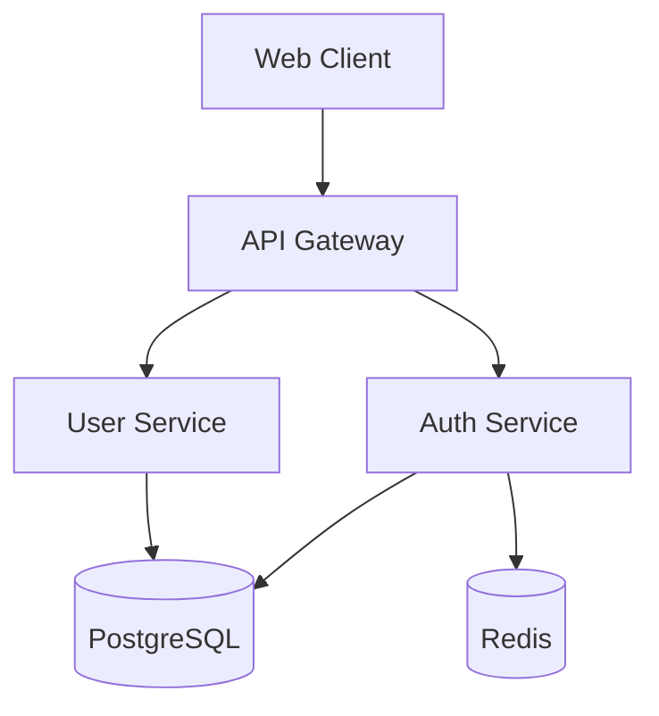
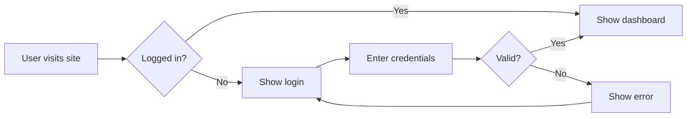

# Example Feature Spec

## Overview

This is an example spec to demonstrate VisualSDD.

## Architecture

## User Flow

## Requirements

- Users can log in with email/password
- Sessions expire after 24 hours
- Failed logins are rate-limited

## Tasks

- [ ] Design database schema
- [ ] Implement auth endpoints
- [ ] Build login UI
